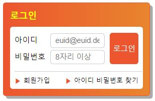

# Mission-02

## Result

## HTML Markup Structure

+ div.loginBox : 로그인 박스의 메인 컨테이너 요소

  + h2 : 로그인 박스의 타이틀(로그인 폼) 요소

  + form : 사용자의 로그인 정보 데이터를 입력받기 위한 요소

    + fieldset : 로그인 input 및 label 요소들과 컨트롤을 위한 button 요소를 묶어줄 로그인 영역 요소

      + legend : fieldset 요소의 설명

      + div.userEmail__box : 사용자의 이메일 정보를 입력받기 위한 요소들의 컨테이너
      
        + label : input 요소를 식별해줄 컨트롤 레이블

        + input : 이메일 정보를 입력하는 입력 영역 모델

          - 반드시 입력받아야 하는 정보이므로 required 속성 추가
      
      + div.userPassword__box : 사용자가 로그인할 계정의 암호 입력 요소
      
        + label : input 요소를 식별해줄 컨트롤 레이블

        + input : 이메일 정보를 입력하는 입력 영역 모델

          - 반드시 입력받아야 하는 정보이므로 required 속성 추가

      + button : 입력된 정보를 서버로 보내기 위한 button 요소

    + div.joinFindBox : 회원가입, 아이디 비밀번호 찾기 기능을 위한 부가 가능 컨테이너

      + a.join__link : 회원가입 링크를 제공하는 요소

      + a.find__link : 아이디 비밀번호 찾기 링크를 제공하는 요소

## CSS Explanation

.loginBox {
  width: 15rem;
  padding: 0.75rem;
  background: linear-gradient(to right, #ED552F, #E8852E);
  border: 1px solid #ED552F;
  border-radius: 5px;
  box-shadow: 5px 5px #aaaaaa;
}`
  - 바깥쪽 주황색 박스 요소 디자인 및 여백 설정

.loginForm {
  background-color: #fff;
  margin-top: 10px;
  font-size: 0.875rem;
  border-radius: 5px;
}
  - 안쪽 흰색 박스 요소 디자인 및 여백 설정

.loginTitle {
  font-size: 1rem;
  font-weight: bold;
  margin: 0;
  color: yellow;
}
 - h2 요소 디자인 및 agent style 여백 제거

.loginFieldset {
  padding: 0.5rem 0;
  margin-left: 0.5rem;
  border: #fff;
  position: relative;
  border-bottom: 1px solid #CCCCCC;
}
 - fieldset 박스 디자인
 - position: relative 속성 선언하여 로그인 버튼의 position 기준으로 설정

legend {
  overflow: hidden;
  position: absolute !important;
  clip: rect(0, 0, 0, 0);
  clip-path: inset(50%);
  width: 1px;
  height: 1px;
  margin: -1px;
}
 - legend 요소 a11y 숨김

.loginLabel {
  display: inline-block;
  width: 60px;
}
 - 아이디/비밀번호 레이블 요소의 인라인 블록 설정
 - 인라인 블록 요소를 설정해여 input 요소를 옆에 위치시킬 수 있음

.loginInputBox {
  width: 5rem;
  height: 24px;
  border: 1px solid #CCCCCC;
  border-radius: 5px;
  padding: 0 0.5rem;
}
 - 이메일/비밀번호 input 박스 디자인 및 여백 설정

.loginButton {
  background-color: #ED552F;
  color: #fff;
  position: absolute;
  top: 11px;
  right: 6px;
  height: 56px;
  border: none;
  border-radius: 5px;
}
 - 로그인 버튼 디자인 및 여백, position 설정

.userEmail__box,
.userPassword__box {
  margin: 4px 0;
}
 - 이메일/비밀번호 입력 박스의 바깥 여백 설정

.joinFindBox {
  font-size: 12px;
  padding: 0.5rem;
  display: flow-root;
}
- 회원가입, 아이디 비밀번호 찾기 컨테이너 박스를 flow-root 로 지정하고 안쪽 여백 설정

.join__link {
  float: left;
  color: black;
  text-decoration: none;
}
 - 회원가입 요소를 float 요소로 지정

.find__link {
  float: right;
  color: black;
  text-decoration: none;
}
 - 아이디 비밀번호 찾기 요소를 float 요소로 지정

.join__link::before,
.find__link::before {
  content: "\25B6  ";
  color: #ED552F;
}
  - 회원가입과 아이디 비밀번호 찾기 텍스트 앞의 기호를 가상요소로 삽입