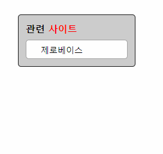
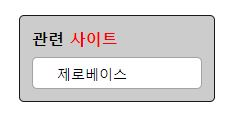
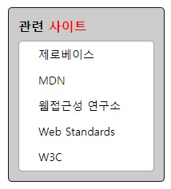

# Mission-03

## Result
  

---
## HTML Markup Structure


```
<body>
  <section class="relatedSite">
    <h2 class="relatedSiteTitle">관련 <span>사이트</span></h2>
    <ul class="listWrapper">
      <li>
        <a href="https..." target="_blank" rel="noopener noreferer"
          tabindex="-1">제로베이스</a>
      </li>
      <li>
        <a href="https..." target="_blank" rel="noopener noreferer"
          tabindex="-1">MDN</a>
      </li>
      <li>
        <a href="http..." target="_blank" rel="noopener noreferer"
          tabindex="-1">웹접근성 연구소</a>
      </li>
      <li>
        <a href="https..." target="_blank" rel="noopener noreferer"
          tabindex="-1">Web Standards</a>
        </li>
      <li>
        <a href="https." target="_blank" rel="noopener noreferer"
          tabindex="-1">W3C</a>
      </li>
    </ul>
  </section>
</body>
```


`<section>` 요소를 사용하여 '관련 사이트' 박스 요소를 생성하고, 박스 요소 안에 h2, 리스트 요소를 구현하였습니다.

하이퍼링크가 연결되는 anchor 요소에는 `rel="noopener noreferer"` 속성을 사용하여 취약점을 보완하였고,

숨겨진 리스트 아이템들을 tab 키로 선택할 것을 대비하여 `tabindex="-1"` 속성을 사용해 아이템들을 tab 키로 지정할 수 없도록 하였습니다.


---
## CSS Explanation
li 요소를 감싼 ul 요소(listWrapper)에 속성을 선언하여 기본적으로 한 줄만 출력되며,

흰색 영역에 마우스를 위치하면(hover) 높이가 늘어나며 모든 요소가 표시되도록 구현했습니다.

transition 속성을 사용하여 이러한 과정이 애니메이션으로 작동하도록 선언하였습니다.
```
.listWrapper {
  height: 32px;
  line-height: 2rem;
  overflow: hidden;
  transition: height 0.5s;
}

.listWrapper:hover {
  height: 164px;
}
```

 


