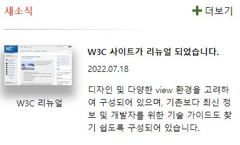
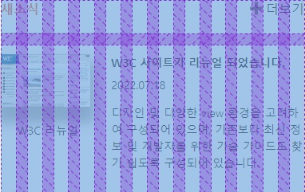

# Mission-04

## Result
  

---
## HTML Markup Structure


```
<body>
  <section class="news">
    <h2 class="newsTitle">새소식</h2>
    <a href="/" target="_blank" rel="noopener noreferer" class="newsMore">더보기</a>
    <figure class="newsArticleThumbnail">
      
      <figcaption>W3C 리뉴얼</figcaption>
    </figure>
    <article class="newsArticle">
      <h3 class="newsArticleTitle">W3C 사이트가 리뉴얼 되었습니다.</*h3>
      <p class="newsArticleDate">
        <time datetime="2022-07-18">2022.07.18</time>
      </p>
      <p class="newsArticleDetail">디자인 및 다양한...</p>
    </article>
  </section>
</body>
```


`<section>` 요소를 사용하여 '새소식' 박스 요소를 생성했습니다.
구성은 다음과 같습니다.
- 새소식(title) : `h2.newsTitle`
- 더보기 : `a.newsMore`
- 썸네일 박스 : `figure.newsArticleThumbnail > img.+figcaption`
- 기사(article) 박스 : `article.newsArticle > (h3.newsArticleTitle + p.newsArticleDate + p.newsArticleDetail)`

하이퍼링크가 연결되는 anchor 요소에는 `rel="noopener noreferer"` 속성을 사용하여 취약점을 보완하였습니다.

기사의 성격을 반영하여 `<article>` 박스 요소를 사용하였습니다.

`p.newsArticleDate` 요소의 날짜는 `<time datetime="2022-07-18">` 속성을 사용하여 날짜를 컴퓨터가 인식할 수 있도록 하였습니다.


---
## CSS Explanation
텍스트 타이포그래피 속성과 박스 간격 요소는 설명에서 제외하겠습니다.

메인 박스인 새소식, `section.news` 박스에 `display: grid;` 를 선언하고, 갭은 1rem, column 속성을 12등분으로 지정하는 등 기본적인 설정을 입력했습니다.

```
.news {
  display: grid;
  max-width: 380px;
  grid-template-columns: repeat(12, 1fr);
  grid-template-rows: auto;
  grid-gap: 1rem;
}
```

각 영역별로 grid-area 를 알맞게 지정하였습니다.

`newsTitle` 을 가로 8칸으로 지정하고, `border-bottom` 속성과 `border-image: linear-gradient` 속성값을 사용하여 그라디언트 border 를 디자인 하였습니다.
```
.newsTitle { grid-area: 1/1/2/9; } # 가로 8칸
.newsMore { grid-area: 1/9/2/13; } # 가로 4칸
.newsArticleThumbnail { grid-area: 2/1/3/5; } # 가로 4칸
.newsArticle { grid-area: 2/5/3/13; } # 가로 8칸

.newsTitle{
  border-bottom: 1px solid;
  border-image: linear-gradient(to right, #A9A9A9, white) 1;
}
```

더보기 옆 + 아이콘은 이미지를 다운로드하여 가상 요소 선택자로 추가하였습니다.
```
.newsMore::before {
  content: url(../images/icon_plus.png);
  position: relative;
  margin: 4px;
  top: 2px;
}
```

**결과물**

  


