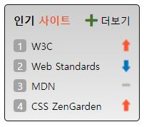

# Mission-05

## Result
  


---
## HTML Markup Structure


```
<body>
  <div class="favorite box">
    <h2 class="favoriteTitle">인기 <span>사이트</span></h2>
    <ol class="favoriteList">
      <li class="favoriteItem spriteUp">
        <a href="/" class="favortieLink" target="_blank" rel="noopener noreferrer">W3C</a>
      </li>
      <li class="favoriteItem spriteDown">
        <a href="/" class="favortieLink" target="_blank" rel="noopener noreferrer">Web Standards</a>
      </li>
      <li class="favoriteItem spriteMaintain">
        <a href="/" class="favortieLink" target="_blank" rel="noopener noreferrer">MDN</a>
      </li>
      <li class="favoriteItem spriteUp">
        <a href="/" class="favortieLink" target="_blank" rel="noopener noreferrer">CSS ZenGarden</a>
      </li>
    </ol>
    <a href="/" class="favoriteMore" target="_blank" rel="noopener noreferrer">
      <span class="fas fa-plus"></span>더보기
    </a>
  </div>
</body>
```


`<section>` 요소를 사용하여 '새소식' 박스 요소를 생성했습니다.
구성은 다음과 같습니다.
- 인기 사이트(title) : `h2.favoriteTitle`
  - '사이트'의 색이 다르기 때문에 CSS를 따로 지정해줄 `span` 요소를 사용했습니다.
- 순차형 리스트 : `ol.favoriteList > (li.favoriteItem > a.favortieLink)*4`
  - list-item 요소에 각각 spriteUp, spriteMaintain, spriteDown 클래스를 배치했습니다.
- 더보기 : `a.favoriteMore > span.fas fa-plus`
  - anchor 요소 안에 span 태그를 활용해 + 모양 아이콘을 삽입했습니다.

하이퍼링크가 연결되는 anchor 요소에는 `rel="noopener noreferer"` 속성을 사용하여 취약점을 보완하였습니다.


---
## CSS Explanation
텍스트 <u>타이포그래피 속성</u>과 <u>박스 간격 요소(`padding`, `margin`)</u>는 설명에서 제외하겠습니다.


### Flex 마크업
- 레이아웃을 flexbox로 구성하기 위해 가장 상위요소인 `favorite` 박스에 `display: flex;` 를 선언하였습니다.
- `flex-direction: row` / `flex-wrap: wrap` 으로 설정한 후, 하위 요소 중 `favoriteList` 리스트 요소에 `order: 1` 을 설정하여 가장 아래에 배치될 수 있도록 하였습니다.
- `favorite` 요소도 flex로 지정하고 **리스트 아이템**인 `favoriteItem` 요소의 갭을 설정하였습니다.
```
.favorite {
  display: flex;
  flex-flow: row wrap;
  justify-content: space-between;
  gap: 16px;
}

.favoriteList {
  width: 100%;
  order: 1;
  display: flex;
  flex-flow: column nowrap;
  gap: 10px;
}
```


### List Item Bullet
- 리스트 아이템의 number bullet은 `counter-increment`, `content: counter(number)` 속성을 사용하여 생성하였습니다.
- 기본적으로 anchor 태그는 inline 요소이지만, flex를 지정하여 block 요소 상태가 되었기 때문에 number bullet을 디자인할 `favoriteItem::before` 요소를 inline-block 으로 지정하였습니다.
```
.favoriteItem {
  list-style: none;
  counter-increment: number;
}

.favoriteItem::before {
  content: counter(number);
  display: inline-block;
  width: 18px;
  background: #A3A3A3;
  text-align: center;
  color: #FFF;
  border-radius: 4px;
  margin-right: 2px;
}
```


### Sprite, Background, Icon Design
- 리스트 우측 끝 이미지 요소는 sprite 이미지를 background 지정한 후, background-position의 첫번째 value를 right로 선언하여 오른쪽 끝으로 배치였습니다.
- 두번째 value를 top/center/bottom 로 지정하여 sprite 이미지의 각각의 요소가 구현될 수 있도록 디자인 하였습니다.
```
.favoriteItem {
  background: url(../images/rank.png) no-repeat 0 0 / 12px 500%;
}

.spriteUp {
  background-position: right top;
}

.spriteMaintain {
  background-position: right center;
}

.spriteDown {
  background-position: right bottom;
}
```